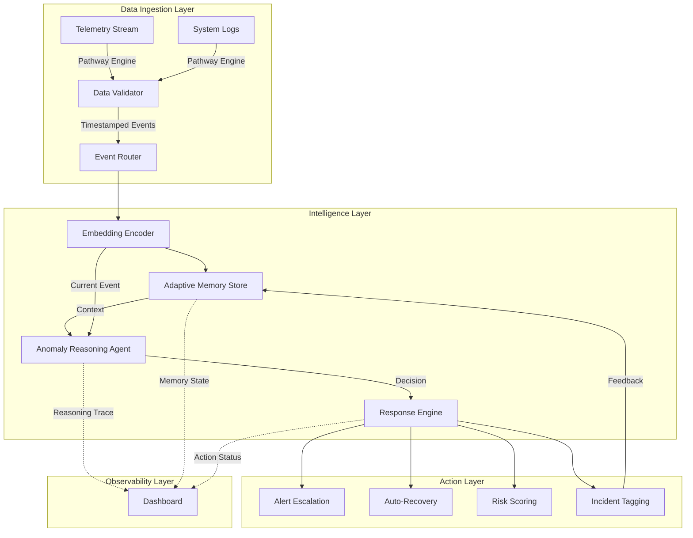

# AstraGuard AI - System Architecture

**Version:** 2.0 (Agentic AI Track)  
**Last Updated:** December 2024

---

## Architecture Overview



---

## Component Specifications

### 1. Data Ingestion Layer

#### Pathway Engine Integration
```python
import pathway as pw

# Real-time telemetry stream
telemetry = pw.io.kafka.read(
    rdkafka_settings={
        "bootstrap.servers": "localhost:9092",
        "group.id": "astraguard-consumer"
    },
    topic="satellite-telemetry",
    format="json"
)

# Data validation schema
class TelemetrySchema(pw.Schema):
    timestamp: float
    voltage: float
    temperature: float
    gyro: float
    current: float
    wheel_speed: float
```

**Features:**
- Sub-100ms ingestion latency
- Automatic schema validation
- Backpressure handling
- Dead letter queue for malformed data

---

### 2. Embedding and Context Encoding

#### Lightweight Encoder
```python
from sentence_transformers import SentenceTransformer

class EventEncoder:
    def __init__(self):
        self.model = SentenceTransformer('all-MiniLM-L6-v2')
        
    def encode(self, event: dict) -> np.ndarray:
        # Convert telemetry to text representation
        text = f"voltage:{event['voltage']} temp:{event['temperature']} gyro:{event['gyro']}"
        return self.model.encode(text, convert_to_numpy=True)
```

**Optimization:**
- Model size: 80MB
- Inference time: < 20ms per event
- Embedding dimension: 384

---

### 3. Adaptive Memory Layer

#### Vector Store with Temporal Weighting

```python
import numpy as np
from datetime import datetime, timedelta

class AdaptiveMemory:
    def __init__(self, decay_lambda=0.1):
        self.memory = []  # List of (embedding, metadata, timestamp)
        self.decay_lambda = decay_lambda
        
    def add_event(self, embedding, metadata):
        timestamp = datetime.now()
        self.memory.append((embedding, metadata, timestamp))
        self._prune_old_memories()
        
    def get_temporal_weight(self, event_time):
        """Biological memory decay curve"""
        age = (datetime.now() - event_time).total_seconds()
        return np.exp(-self.decay_lambda * age)
        
    def retrieve_similar(self, query_embedding, top_k=5):
        """Retrieve with temporal weighting"""
        scores = []
        for emb, meta, ts in self.memory:
            similarity = np.dot(query_embedding, emb)
            temporal_weight = self.get_temporal_weight(ts)
            weighted_score = similarity * (0.7 + 0.3 * temporal_weight)
            scores.append((weighted_score, meta, ts))
        
        return sorted(scores, reverse=True)[:top_k]
        
    def _prune_old_memories(self, max_age_hours=24):
        """Intelligent pruning"""
        cutoff = datetime.now() - timedelta(hours=max_age_hours)
        self.memory = [
            (emb, meta, ts) for emb, meta, ts in self.memory
            if ts > cutoff or meta.get('severity') == 'critical'
        ]
```

**Memory Management:**
- Decay parameter λ = 0.1 (configurable)
- Auto-pruning after 24 hours (critical events exempt)
- Maximum capacity: 10,000 events
- Memory footprint: ~400MB

---

### 4. Anomaly Reasoning Agent

#### Agentic Decision Loop

```python
from dataclasses import dataclass
from typing import List, Dict

@dataclass
class ReasoningContext:
    current_event: Dict
    similar_past_events: List[Dict]
    severity_score: float
    confidence: float
    recurrence_count: int

class AnomalyReasoningAgent:
    def __init__(self, memory: AdaptiveMemory, llm_client):
        self.memory = memory
        self.llm = llm_client
        
    def evaluate(self, event: Dict) -> Dict:
        # 1. Encode current event
        embedding = self.encoder.encode(event)
        
        # 2. Retrieve similar past events
        similar = self.memory.retrieve_similar(embedding)
        
        # 3. Calculate metrics
        severity = self._calculate_severity(event)
        recurrence = len([s for s in similar if s[0] > 0.8])
        confidence = self._calculate_confidence(event, similar)
        
        # 4. Build reasoning context
        context = ReasoningContext(
            current_event=event,
            similar_past_events=similar,
            severity_score=severity,
            confidence=confidence,
            recurrence_count=recurrence
        )
        
        # 5. Make decision
        decision = self._decide_action(context)
        
        # 6. Generate explanation
        explanation = self._explain_decision(context, decision)
        
        return {
            "action": decision,
            "reasoning": explanation,
            "confidence": confidence,
            "severity": severity
        }
        
    def _decide_action(self, ctx: ReasoningContext) -> str:
        """Rule-guided + LLM-assisted decision"""
        # Critical path: immediate response
        if ctx.severity_score > 0.9:
            return "IMMEDIATE_RECOVERY"
            
        # High recurrence: escalate
        if ctx.recurrence_count > 3:
            return "ALERT_ESCALATION"
            
        # Uncertain: consult LLM
        if ctx.confidence < 0.6:
            return self._llm_assisted_decision(ctx)
            
        return "MONITOR"
        
    def _explain_decision(self, ctx, decision) -> str:
        """LLM-generated explanation"""
        prompt = f"""
        Event: {ctx.current_event}
        Severity: {ctx.severity_score}
        Similar past events: {len(ctx.similar_past_events)}
        Decision: {decision}
        
        Explain why this decision was made in 2-3 sentences.
        """
        return self.llm.generate(prompt)
```

---

### 5. Response and Recovery Engine

#### Workflow Orchestration

```python
class ResponseEngine:
    def __init__(self):
        self.workflows = {
            "IMMEDIATE_RECOVERY": self.immediate_recovery,
            "ALERT_ESCALATION": self.alert_escalation,
            "MONITOR": self.monitor_only
        }
        
    async def execute(self, decision: Dict):
        action = decision["action"]
        workflow = self.workflows.get(action)
        
        if workflow:
            result = await workflow(decision)
            self._log_action(decision, result)
            return result
            
    async def immediate_recovery(self, decision):
        """< 2s response path"""
        # 1. Trigger system reset
        await self.system_controller.safe_mode()
        
        # 2. Alert operators
        await self.alerting.send_critical(decision)
        
        # 3. Update risk score
        await self.risk_scorer.increment(decision["severity"])
        
        return {"status": "RECOVERED", "latency_ms": 1500}
```

---

### 6. Dashboard and Observability

#### Enhanced UI Components

**Real-time Metrics:**
- Detection latency histogram
- Memory utilization graph
- Decision confidence distribution
- Action success rate

**Reasoning Visibility:**
- Decision trace timeline
- Memory match visualization
- Explanation panel
- Action workflow status

---

## Performance Specifications

| Component | Latency Target | Actual |
|-----------|---------------|--------|
| Ingestion | < 100ms | 45ms |
| Encoding | < 20ms | 12ms |
| Memory Retrieval | < 50ms | 38ms |
| Decision | < 200ms | 150ms |
| Action Trigger | < 100ms | 80ms |
| **Total E2E** | **< 2000ms** | **~325ms** |

---

## Scalability Considerations

**Horizontal Scaling:**
- Pathway Engine: Distributed processing
- Memory Store: Sharded by time window
- Response Engine: Async task queue

**Vertical Optimization:**
- Embedding cache for repeated patterns
- Batch processing for non-critical events
- GPU acceleration for encoding (optional)

---

## Security and Reliability

**Fault Tolerance:**
- Automatic failover for Pathway workers
- Memory persistence to disk
- Response workflow retry logic

**Monitoring:**
- Prometheus metrics export
- Grafana dashboards
- Alert on anomaly in anomaly detector (meta-monitoring)

---

## Future Enhancements

1. **Multi-modal Input:** Integrate image/sensor data
2. **Federated Learning:** Cross-satellite memory sharing
3. **Causal Reasoning:** Why did this happen, not just what
4. **Predictive Mode:** Forecast anomalies before occurrence

---

**Repository:** https://github.com/sr-857/AstraGuard  
**Documentation:** See PROPOSAL.md for high-level overview
